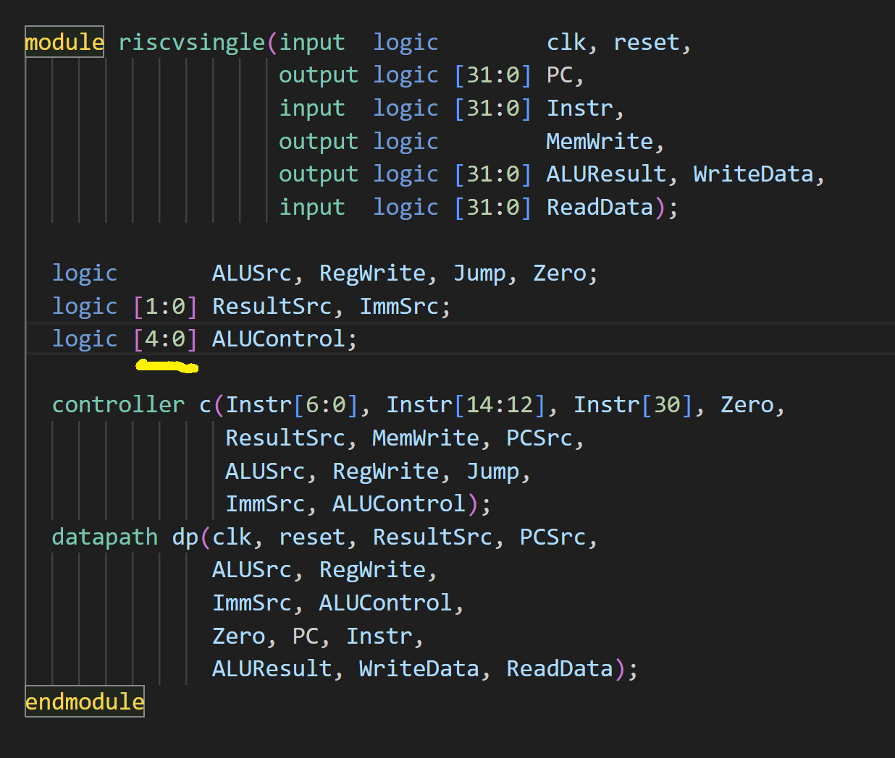

# An Extension of the Standard RV32I Single Cycle Processor

In this project, the standard RV32I single cycle architecture has been taken and 10 custom instructions have been added to the instruction set, called the RVX10.
---
## Design Choices

Architectural State changes are not allowed and hardware change must be kept minimal.

### 1. ALUControl bitwidth changed from 3bits to 5bits

8 ALU operations are already a part of the original architecture. Adding 10 more ALU operations means 18 total operations. To uniquely encode 18 combinations of ALU operations, 5bits of ALUControl are needed.
Bitwidth change must be reflected everywhere, hence, the modules "riscvsingle", "controller", "datapath" and "aludec" have been changed accordingly.



### 2. Adding New ALU Operations

ALU operations corresponding to the other 10 instructions need to be added into the "alu" module. Individual combinations of ALUControls are assigned to each operation, such that they are not redundant with the previous combinations which are extended to 5 bits aswell.

### 3. ALU Decoder change to accomodate new ALUControl width

As the ALUControl bitwidth as increased, ALU Decoder also needs to be changed to match the given opcode, func7 and func3 values to the corresponding ALUControl combination, which will do the operation needed by the instruction.
The ALUOp corresponding to 2'b11 was unused in the original design, hence we can utilize that for the new RVX10 instructions. Since func7 values only change in the 2 least significant bits position, we do not need the entire 7bits of func7 for decoding, along with the func3 values.

### 4. Changes to Main Decoder

As the new RVX10 instructions follow a different opcode, we add a case for the new opcode and assign appropriate control values like ALUOp = 2'b11 to it.

### 5. Writes to x0 are ignored

Since x0 is to be maintained as a "zero" register constantly, in the module "regfile" we need to add the condition ``(a3 != 0)``, i.e.,
```
  if (we & a3 != 0) rf[a3] <= wd;
```

