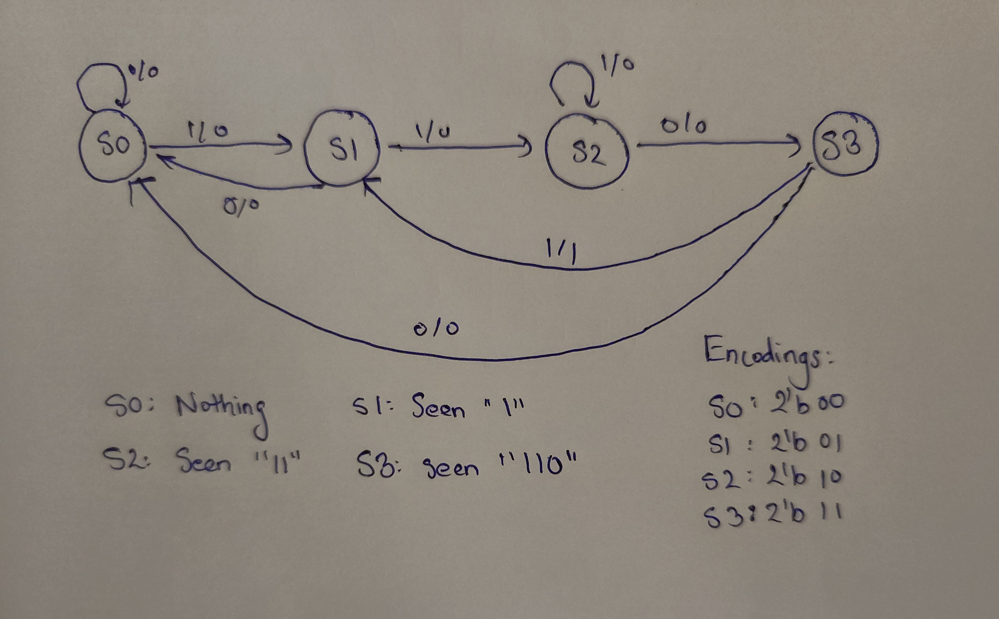

# Sequence Detector (Mealy Machine) – Verilog Project

## Overview

This project implements a **Mealy-type finite state machine (FSM)** in Verilog that detects the bit sequence `1101` in a serial input stream. The FSM outputs a **1-cycle pulse** whenever the sequence is detected. A Verilog **testbench** is also included to simulate and verify the design.

## Files

- `seq_detect_mealy.v`: Verilog module for the Mealy sequence detector.
- `tb_seq_detect_mealy.v`: Testbench to simulate and validate the sequence detector.
- `seq_detect_mealy.vcd`: Value Change Dump (VCD) file generated during simulation (used for waveform viewing).

---

## Design Details

### Module: `seq_detect_mealy`

#### Ports

| Name | Direction | Description |
|------|-----------|-------------|
| `clk` | Input | Clock signal (positive edge triggered) |
| `rst` | Input | Synchronous active-high reset |
| `din` | Input | Serial input bit (1 bit per clock cycle) |
| `y`   | Output | Output pulse (high for 1 cycle when `1101` is detected) |

#### State Diagram (Encoded)

- **S0 (00)**: Initial state
- **S1 (01)**: Detected `1`
- **S2 (10)**: Detected `11`
- **S3 (11)**: Detected `110`

The FSM transitions based on current state and input bit. When in **S3** and `din == 1`, the FSM outputs `y = 1`, indicating the full `1101` pattern has been detected.

#### Output Behavior

- The output `y` is asserted (`1`) for **one clock cycle** when the input sequence `1101` is detected.
- The machine can detect **overlapping sequences**.

---

## State Diagram




---

## Testbench: `tb_seq_detect_mealy`

- Simulates the FSM by providing a **20-bit input sequence**: `00110011011010011010`
- Clock: 100 MHz (10 ns period)
- Reset is held low throughout the simulation (no reset events).
- Monitors the output `y` during simulation.
- Generates a `.vcd` file for waveform analysis using tools like GTKWave.

### Example Output Pulse

The FSM will assert `y` high (1) at the clock cycle **immediately after** the last bit of a matching `1101` pattern. For the test vector `00110011011010011010`, it should pulse high **each time** `1101` occurs.

---

## How to Simulate(Using Iverilog)

   ```bash
   iverilog -o seq_detect_mealy.vvp seq_detect_mealy.v tb_seq_detect_mealy.v
   vvp seq_detect_mealy.vvp
   gtkwave seq_detect_mealy.vcd


